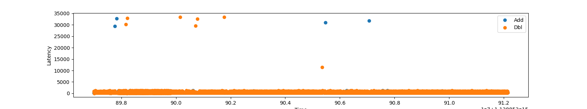
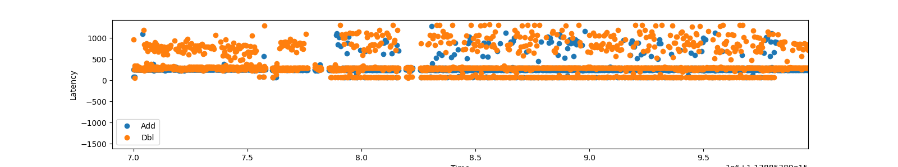
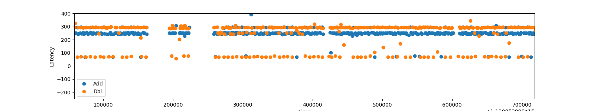
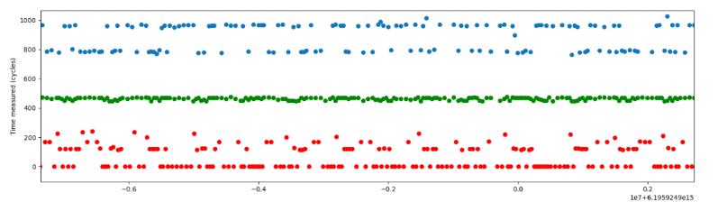

# 缓存侧信道攻击ECDSA

## 文件目录

- ECDSA：针对ECDSA的Flush Reload攻击
  - attaker.c：攻击者程序源码
  - victim.c：受害者程序源码
  - cache_utils.c：相关功能函数
  - ec_key.txt：固定的ECDSA签名密钥
  - plot.py：采集结果可视化脚本
  - Makefile：自动化编译脚本
  - hmmtest.py：使用HMM算法对采集到的序列进行学习和预测，与主程序无关
  - requirements.txt：python依赖库文件
- Reload+Refresh：USENIX 2020 Reload+Refresh攻击原型代码
  - example_code_sync.c：设置同步的接收者进程
  - sender_sync.c：设置同步的发送者进程
  - cache_util.c：相关功能函数（cache驱逐集等相关）
  - common.c：相关功能函数
  - cache_detail.h：cache信息的配置文件
  - T.c：存在公共数组，该文件用于编译生成T.so为接收者与发送者创造共享内存的条件
- README.md：本文件
- Figure：示例结果图片文件
- OpenSSL-1.0.2h：旧版OpenSSL源码

## 环境要求

### 硬件环境

- 处理器架构：Intel x86_64	

- 处理器型号：Intel(R) Core(TM) i5-4590@3.30GHz

- 缓存大小

  - LLC：6MB
  - L2：256KB
  - L1D：32KB；L1I：32KB

- 核心数量：4核4线程，无需超线程

  

### 软件环境

- 操作系统：Ubuntu 18.04 ；Linux Kernel 5.4.0-53
- 编译环境：gcc 7.5.0
- Python版本：3.7.4
- OpenSSL版本：1.0.2h

> 由于可能需要在安装高版本OpenSSL的机器上编译并调用低版本OpenSSL的API，因此需要单独编译旧版本的OpenSSL

### 旧版本OpenSSL的编译

- **Step1**：访问https://github.com/openssl/openssl/releases/tag/OpenSSL_1_0_2h 下载打包后的源码并解压；
- **Step2**：进入解压目录，依次运行以下命令；
  - a)   `$: ./config --prefix=/usr/local --openssldir=/usr/local/ssl`
  - b)  `$: make && make install`
- **Step3**：此时完成了旧版本OpenSSL的静态库安装，之后按照如下命令安装动态库版本；

  - a)  `$: ./config -d shared --prefix=/usr/local --openssldir=/usr/local/ssl`

  - b)  `$: make clean`

  - c)   `$: make && make install`
- 此时，当前目录中应出现了libcrypto.so与libssl.so，若将其用于生成最终的受害者ECDSA程序，可使用以下命令：

  - `$: gcc -o ecdsa_out -L/home/your/path/of/old/openssl -lcrypto`
- 最后，编译链接得到的程序中使用的就是1.0.2h版本OpenSSL实现的ECDSA签名算法，可将其作为受害者程序对其进行攻击。
- 若此时运行程序会发现仍然不能调用旧版本的OpenSSL API，可按如下命令修改动态链接搜索路径：
  - `$: export LD_LIBRARY_PATH=/your/path/of/old/openssl/`
  - `$:source ldconfig`

### Python 依赖库的安装

- 直接使用pip执行依赖库目录文件：
  - `pip3 install -r requirements.txt`
- 等待安装完成后即可使用

## 攻击的运行与结果示例

### Flush+Reload on ECDSA

- 进入ECDSA目录，在`attacker.c`中第28行的路径修改为之前编译的旧版本动态链接库`libcrypto.so`所在路径；
- 打开`Makefile`并修改动态链接库路径；同时一并修改系统`LD_LIBRARY_PATH`路径也为旧版本动态链接库的路径；
- 在终端中输入`make clean && make`进行编译；
- 首先运行攻击者进程`$: ./attacker 1024 130 | python3 plot.py`，紧接着在另一终端中运行受害者进程`$: ./victim`，应得到结果，逐步放大如下所示：
  - 
  - 
  - 
  - 上图中蓝色表示攻击者进程探测到的点加操作，橙色表示点倍操作，时间低于130 CPU Cycles的表示受害者执行了该操作，导致攻击者在reload时计时较短
  - 因此根据运行的结果，就可获得随机数的比特位信息

> 若同时执行攻击者与受害者进程无法捕获数据，请检查Makefile中动态链接库路径、源码中dlopen路径以及两进程终端中的LD_LIBRARY_PATH是否设为一致，该条件是为了确保让两进程共享同一个动态链接库，进而形成共享内存的条件。
>
> 可使用strace、ldd命令查看动态链接库的调用情况。

### Reload + Refresh

- 进入Reload+Refresh目录，编译与配置情况可参照原github [repository](https://github.com/greenlsi/reload_refresh)，其中有以下部分需特别注意：
  - 执行 `echo 100 > /proc/sys/vm/nr_hugepages`时可能遇到无权限执行的问题，可更换为执行
    - `echo 100 | sudo tee /proc/sys/vm/nr_hugepages`
  - **在编译与执行前，请务必参照本机情况配置`cache_details.h`中的缓存信息**
- 攻击代码基本原理
  - Reload+Refresh是一种策略上类似于Prime+Probe的攻击方法，需要构造最小驱逐集并且双方共享内存。在本例中，双方通过访问`libT.so`中数组的公共成员构建共享内存的关系。
  - 该攻击极其依赖于测试机器平台上的缓存替换策略，作者所测试的机器型号如文中[表1所示](https://www.usenix.org/system/files/sec20-briongos_0.pdf)，并且作者声称Intel Core 4-8代CPU上都适用。
- 在以上配置步骤正确执行后，在当前目录下`make clean && make`编译，运行`./example_code_sync 127.0.0.1 1350 -rr 60000`启动同步后的接收者进程，`./sender_sync 127.0.0.1 1350`启动同步后的发送者进程，可得到运行结果存入文件内。
  - 运行命令`$:pyhton3 py_plot_sync.py sender_file attacker_file TIME`，得到可视化结果如下图所示：
  - 
  - 如图所示，红色部分为发送者数据，蓝色部分为接收者数据，可以看到接收方执行Reload+Refresh后，能与发送方建立一隐蔽信道，从而隐蔽地传输某些数据。
  - 在作者提供的攻击原型中，双方进程需通过socket进行同步，否则攻击效果将较差。

> 除Reload Refresh攻击本身外，作者实现了Flush+Reload与Prime+Probe两种攻击，并且驱逐集与候选集的构造与测试对应的函数（如generate_new_eviction_set等）实现方法具有较高的学习意义

- 其余问题与详细配置可参见原作者的README